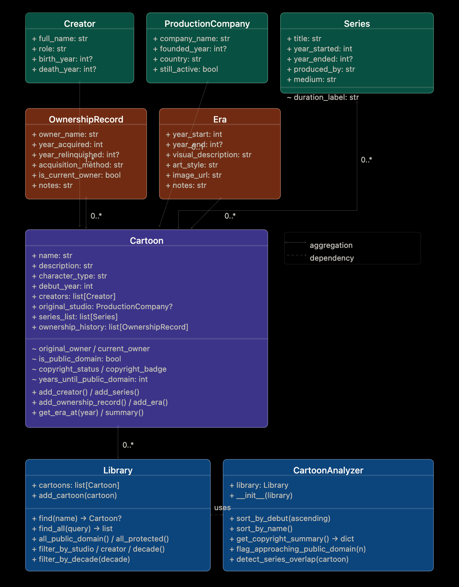

# CartoonPal — Applied AI System

> **Project 4 — Applied AI System** | Extended from PawPal+ (Module 2)

## Original Project

**PawPal+** (Module 2) was a smart pet care management system built with Python OOP — tracking owners, pets, tasks, and schedules through `Owner`, `Pet`, `Task`, and `Scheduler` classes with sorting, conflict detection, and a Streamlit UI.

CartoonPal extends that same four-class architecture into a new domain: cartoon copyright research. The same OOP principles now track who created, produced, and owns animated characters — and whether those characters are in the public domain or still protected.

---

## What CartoonPal Does

CartoonPal is a cartoon copyright and visual history explorer that answers: **who owns a cartoon character, when did ownership change hands, and can you use it freely?**

The system tracks 255 animated characters across 10 studios and uses Claude AI to explain copyright status in plain English — making intellectual property law accessible to anyone.

---

## System Architecture



Four layers:

**1. Data Layer** (`cartoon_system.py`) — Eight OOP classes: `Cartoon`, `Creator`, `ProductionCompany`, `Series`, `OwnershipRecord`, `Era`, `Library`, `CartoonAnalyzer`

**2. Data Population** (`seed_data.py` + `characters/`) — Ten character files covering Disney, Warner Bros., MGM, Hanna-Barbera, Marvel, DC, DIC, Filmation, Schoolhouse Rock, and anime

**3. AI Analysis** (`ai_analysis.py`) — RAG pattern: retrieve structured cartoon data, augment a Claude prompt, generate plain-English copyright explanation with confidence score

**4. UI Layer** (`app.py`) — Streamlit with Search, Browse All, Copyright Dashboard, and Add a Cartoon pages

**Data flow:**
```
User query
  → Library.find_all()
  → Cartoon records displayed in UI
  → [Optional] analyze_copyright_with_ai()
      → Claude API (RAG)
      → Confidence-scored explanation
```

---

## Setup Instructions

```bash
# 1. Clone the repo
git clone https://github.com/YOUR_USERNAME/ai110-applied-ai-system-project-4.git
cd ai110-applied-ai-system-project-4

# 2. Install dependencies
pip3 install -r requirements.txt

# 3. Set Anthropic API key (required for AI analysis)
export ANTHROPIC_API_KEY=your_key_here

# 4. Verify backend
python3 main.py

# 5. Run tests
python3 -m pytest tests/test_cartoonpal.py -v

# 6. Launch app
streamlit run app.py
```

Opens at `http://localhost:8501`. AI analysis requires an API key. All other features work without it.

---

## Sample Interactions

### Example 1 — Public Domain Character

**Input:** Search "felix"

**CartoonPal output:**
- Felix the Cat (1919) — **PUBLIC DOMAIN**
- Ownership: Pat Sullivan (1919) → Sullivan Estate (1933) → Felix the Cat Productions / Don Oriolo (1958–present)

**AI Analysis (Claude):**
> Felix the Cat's original 1919 theatrical shorts entered the US public domain under the 95-year copyright rule. However, Felix the Cat Productions holds active trademark rights, meaning the classic design cannot be used commercially without permission even though copyright has expired. Copyright and trademark are distinct protections — copyright expires, trademark does not as long as it is actively maintained.
> CONFIDENCE: HIGH

---

### Example 2 — Protected Character, Complex Ownership

**Input:** Search "bugs"

**CartoonPal output:**
- Bugs Bunny (1940) — **PROTECTED** — © Warner Bros. Discovery — 9 years remaining
- Ownership chain: Warner Bros. Cartoons (1940) → Warner Bros. Inc. (1969) → Time Warner (1990) → Warner Bros. Discovery (2022–present)

**AI Analysis (Claude):**
> Bugs Bunny debuted in 1940 and remains protected under US copyright law, which grants corporate-owned works 95 years of protection. He will enter the public domain in 2035. All four ownership entities in his chain were transfers via corporate merger rather than sale — Warner Bros. Discovery holds inherited rights from the original creator studio.
> CONFIDENCE: HIGH

---

### Example 3 — Multi-Result Search

**Input:** Search "batman"

**CartoonPal output:**
```
Found 4 records matching "batman":

▼ Batman (animated history) (1939) — Protected — DC Comics
  10 series spanning 1968–present across 5 studios

▼ Batman and Superman (Filmation animated) (1968)
  Producer: Filmation Associates under DC license

▼ Batman (The Animated Series) (1992)
  Producer: Warner Bros. Animation — created Harley Quinn

▼ Batman Beyond — Terry McGinnis (1999)
  Future Batman set in 2039 Gotham City
```

---

## AI Feature — RAG Implementation

**Pattern:** Retrieval-Augmented Generation via Anthropic Claude API (`claude-sonnet-4-5`)

**Why RAG?** General AI models have inconsistent knowledge of obscure cartoon copyright details. By retrieving verified structured data first, Claude's analysis is grounded in facts rather than approximations.

**The three steps (in `ai_analysis.py`):**

1. **RETRIEVE** — Pull the cartoon's full record: ownership chain, debut year, creators, copyright status, years until public domain
2. **AUGMENT** — Build a structured prompt embedding all retrieved facts as context
3. **GENERATE** — Claude returns a 2-3 sentence explanation + `CONFIDENCE: HIGH/MEDIUM/LOW`

Confidence is parsed from the response and displayed with color-coded badges (green/yellow/red).

---

## Algorithmic Layer (Smarter Scheduling)

| Algorithm | Method | How it works |
|---|---|---|
| Sort by debut | `sort_by_debut()` | `sorted()` with `lambda c: c.debut_year` |
| Sort by name | `sort_by_name()` | `sorted()` with `lambda c: c.name.lower()` |
| Filter by status | `all_public_domain()` | O(n) filter on computed `is_public_domain` property |
| Filter by studio | `filter_by_studio()` | Case-insensitive partial string match |
| Filter by decade | `filter_by_decade()` | Range check: `decade <= debut_year < decade + 10` |
| Conflict detection | `detect_series_overlap()` | O(n²) pairwise date-range comparison |
| Copyright flagging | `flag_approaching_public_domain()` | Filter: `0 < years_until_pd <= N` |

**Tradeoff:** Series overlap uses year-level precision. Two series ending and beginning in the same calendar year are flagged as overlapping even if they didn't actually run simultaneously. Simpler and easier to test than month-level precision.

---

## Testing

```bash
python3 -m pytest tests/test_cartoonpal.py -v
```

**42 tests — 42 passing — 0.29 seconds**

| Test area | What is verified |
|---|---|
| Creator logic | Adding creators increases count; creator string representation |
| Series logic | Series sorted by year; duration labels for ongoing vs. ended |
| Ownership chain | Current owner flagged correctly; previous owners deflagged; original is earliest |
| Copyright rules | Pre-1928 = public domain; no owner = public domain; 95-year boundary |
| Library | find() partial match; find_all() multi-result; filter by decade, creator, studio |
| Analyzer | sort ascending/descending; copyright summary totals; approaching PD filter |
| Conflict detection | Overlapping series flagged; non-overlapping series not flagged |
| Seed data integrity | 255 characters load; every cartoon has eras and ownership records |

**Testing summary:** 42/42 pass. The copyright boundary tests are the most critical — they verify the 95-year rule that drives every copyright determination. Seed data integrity tests catch import errors and missing data across all 10 character files.

**Confidence level: ★★★★☆ (4/5)** — Core logic reliable. One limitation: copyright calculation applies US law only. International frameworks (Japan life+50, EU life+70) are not modeled.

---

## Design Decisions

**1. Separate Creator / ProductionCompany / OwnershipRecord**
These are legally distinct. Bill Finger co-created Batman but owned nothing. Fleischer Studios produced Popeye but King Features owned it. Three separate classes is the most accurate design.

**2. RAG over standalone AI lookup**
Claude's training knowledge of obscure copyright details is inconsistent. Retrieved structured data from CartoonPal's database is more accurate. AI explains the data; it doesn't recall it.

**3. find_all() over find()**
Original `find()` returned only the first match — "batman" returned the 1968 Filmation cartoon. `find_all()` returns all 4 Batman records sorted by debut year, showing the complete picture.

**4. Modular character files**
Adding a new studio requires only: create one file in `characters/`, add one import to `seed_data.py`. The system is designed to grow.

---

## Reflection

The most important lesson from CartoonPal is that **RAG works because the retrieved data is better than the AI's memory**. Claude's copyright explanations grounded in CartoonPal's structured ownership chains were substantially more accurate than what a general-knowledge prompt would produce.

The second lesson: AI collaboration requires the human to act as architect. The more precise the specification, the better the result. "Track ownership as a list of OwnershipRecord dataclasses each with owner_name, year_acquired, acquisition_method, and is_current_owner" produces exactly the right code. "Track who owns it" produces something generic.

**One helpful AI suggestion:** Early in the project, AI suggested separating the `find()` method into `find()` for single-result and `find_all()` for multi-result, noting that characters like Batman would appear across multiple records. This was the right call and required rebuilding the entire search page.

**One flawed AI suggestion:** AI initially reported Mickey Mouse as fully protected. This was partially incorrect — the 1928 Steamboat Willie film entered US public domain on January 1, 2024, while the Mickey Mouse trademark remains fully protected. The copyright/trademark distinction is legally significant and had to be manually verified and corrected.

**Limitations and ethics:**
- Not legal advice — for educational purposes only
- US copyright law applied uniformly regardless of character's country of origin
- Trademark protection (perpetually renewable) is mentioned but not fully modeled
- Historical ownership records may contain inaccuracies in complex corporate merger histories

**Loom video walkthrough:** [Watch the demo](https://www.loom.com/share/09d86a92f2864c7ea17b18d36ea7c5fb)
---

## File Structure

```
ai110-applied-ai-system-project-4/
├── cartoon_system.py           # OOP classes — core logic
├── seed_data.py                # Library builder
├── ai_analysis.py              # RAG AI module (Anthropic API)
├── main.py                     # CLI demo script
├── app.py                      # Streamlit UI
├── requirements.txt
├── README.md
├── reflection.md
├── characters/
│   ├── __init__.py
│   ├── anime_characters.py     # Sailor Moon, Dragon Ball Z
│   ├── dc_characters.py        # Batman, Superman, Wonder Woman
│   ├── dic_characters.py       # Inspector Gadget, Jem
│   ├── disney_characters.py    # 50+ Disney characters
│   ├── filmation_characters.py # He-Man, She-Ra, Fat Albert
│   ├── hanna_barbera_characters.py  # Flintstones, Jetsons, 30+ HB
│   ├── marvel_characters.py    # Spider-Man, X-Men, Avengers
│   ├── mgm_characters.py       # Droopy, MGM cartoons
│   ├── schoolhouse_rock.py     # All Schoolhouse Rock segments
│   └── wb_characters.py        # Looney Tunes, Animaniacs, DCAU
├── tests/
│   └── test_cartoonpal.py      # 42 automated tests
└── assets/
    └── uml_final.png           # UML class diagram
```